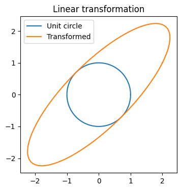

# Eigenvalues and Eigenvectors

## Introduction
Eigenvalues and eigenvectors describe special directions that remain unchanged in direction under a linear transformation.

For a square matrix $A$:

$$A\mathbf{v}=\lambda\mathbf{v}$$

where:
- $\mathbf{v}$ = eigenvector
- $\lambda$ = eigenvalue

## Intuition

Most vectors change both **direction** and **length** after multiplication by a matrix.

An eigenvector changes only its **length** (and possibly reverses direction if the eigenvalue is negative).


## Geometric Interpretation

A linear transformation maps the unit circle into an ellipse.

The principal axes of the ellipse are eigenvector directions.



## Finding Eigenvalues

For matrix

```text
A = [[2,1],
     [1,2]]
```

Solve

```math
det(A-\lambda I)=0
```

Characteristic polynomial:

```math
(2-\lambda)^2-1=0
```

Eigenvalues:

- λ₁ = 3
- λ₂ = 1

Corresponding eigenvectors:

- λ=3 → [1,1]
- λ=1 → [1,-1]

## Applications

- PCA
- Machine Learning
- Computer Vision
- Graph Analysis
- Quantum Mechanics
- Stability Analysis

# Python Implementation

```python
import numpy as np

A = np.array([[2,1],
              [1,2]])

eigenvalues, eigenvectors = np.linalg.eig(A)

print("Eigenvalues:")
print(eigenvalues)

print("\nEigenvectors:")
print(eigenvectors)

# Verify Av = λv
for i in range(len(eigenvalues)):
    v = eigenvectors[:, i]
    lhs = A @ v
    rhs = eigenvalues[i] * v

    print(f"\nVerification for Eigenvalue {eigenvalues[i]:.2f}")
    print("A @ v =", lhs)
    print("λ * v =", rhs)
```

## Manual Verification

```python
import numpy as np

A=np.array([[2,1],[1,2]])

v=np.array([1,1])

print(A@v)
print(3*v)
```

## PCA Example

```python
from sklearn.decomposition import PCA
import numpy as np

X=np.array([
[2,3],
[3,4],
[4,5],
[5,6]
])

pca=PCA(n_components=2)
pca.fit(X)

print("Principal Components:")
print(pca.components_)

print("Explained Variance:")
print(pca.explained_variance_)
```

## Time Complexity

- `numpy.linalg.eig`: approximately O(n³)

## Summary

- Eigenvectors preserve direction.
- Eigenvalues indicate scaling.
- Widely used in AI, ML, Computer Vision, recommendation systems, and numerical analysis.
