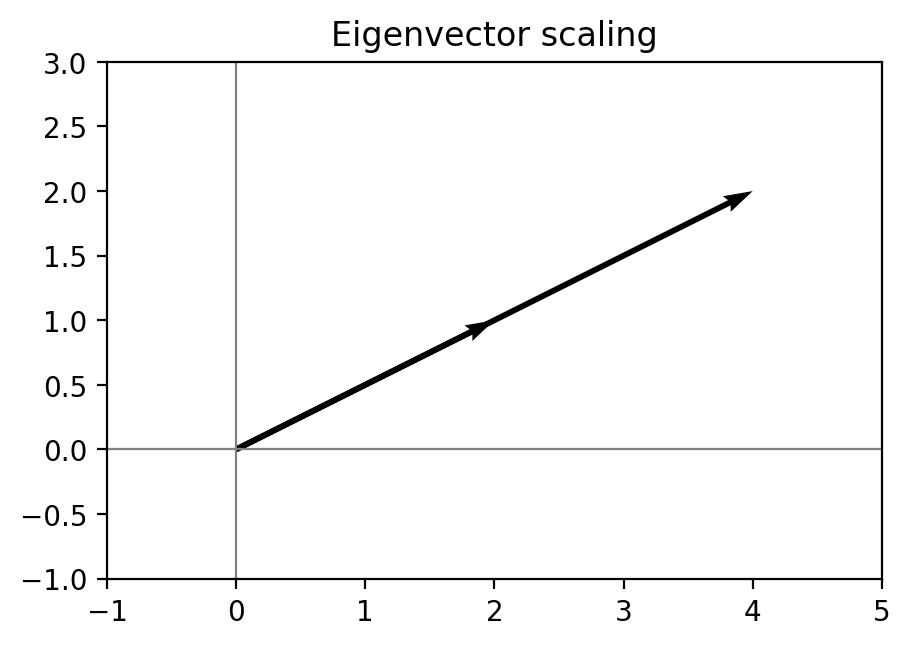
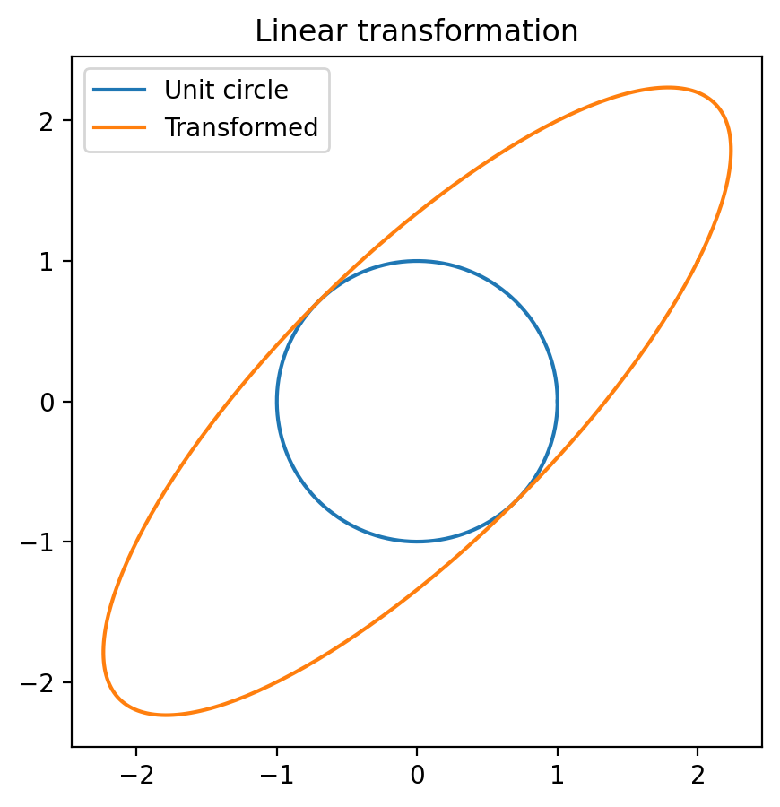
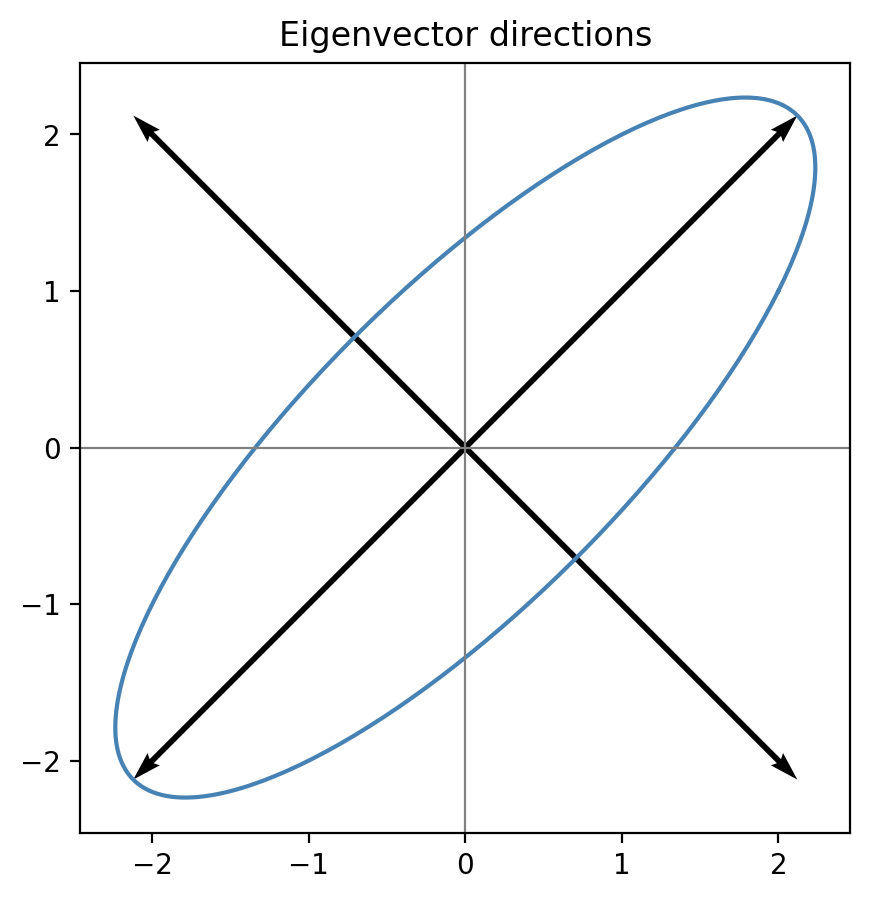

# Eigenvalues and Eigenvectors

## Introduction

Eigenvalues and eigenvectors are among the most important concepts in linear algebra. They describe special directions in which a linear transformation acts only by scaling.

For a square matrix A,

A v = lambda v

where v is an eigenvector and lambda is the corresponding eigenvalue.

## Geometric intuition

Most vectors change both direction and magnitude after a transformation. Eigenvectors keep the same direction.



## Linear transformation

A matrix transforms the unit circle into an ellipse.



## Eigenvector directions

The principal axes of the transformed ellipse are the eigenvector directions.



## Example

For

A = [[2,1],[1,2]]

the eigenvalues are 3 and 1, and the corresponding eigenvectors are [1,1] and [1,-1].

## Python implementation

```python
import numpy as np

A = np.array([[2,1],[1,2]])

eigenvalues, eigenvectors = np.linalg.eig(A)

print(eigenvalues)
print(eigenvectors)

for i in range(len(eigenvalues)):
    v = eigenvectors[:, i]
    print(A @ v)
    print(eigenvalues[i] * v)
```

## PCA example

```python
from sklearn.decomposition import PCA
import numpy as np

X = np.array([
    [2,3],
    [3,4],
    [4,5],
    [5,6]
])

pca = PCA(n_components=2)
pca.fit(X)

print(pca.components_)
print(pca.explained_variance_)
```

## Applications

- Principal Component Analysis
- Machine Learning
- Computer Vision
- Graph Analysis
- Quantum Mechanics
- Stability Analysis

## Summary

- Eigenvectors preserve direction.
- Eigenvalues determine scaling.
- They enable matrix diagonalization.
- They are fundamental in modern data science and engineering.
