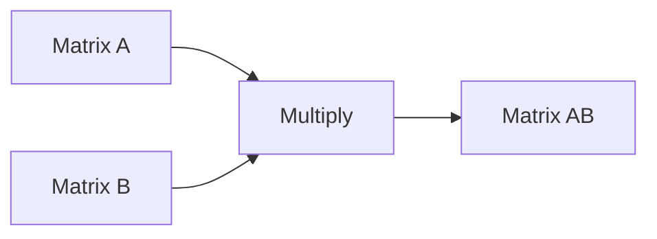
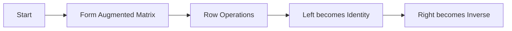

# Matrix Operations and Matrix Inverses

> **Linear Algebra Reading Material**

## Learning Outcomes

- Perform basic matrix operations.
- Compute matrix inverses.
- Understand conditions for invertibility.
- Implement concepts in Python.

---

# 1. Matrix

A matrix is a rectangular array of numbers.

$$
A=\begin{bmatrix}
1&2\\
3&4
\end{bmatrix}
$$

---

# 2. Matrix Addition

Matrices must have the same dimensions.

$$
A+B=
\begin{bmatrix}
a_{11}+b_{11} & a_{12}+b_{12}\\
a_{21}+b_{21} & a_{22}+b_{22}
\end{bmatrix}
$$

Example

$$
\begin{bmatrix}
1&2\\
3&4
\end{bmatrix}
+
\begin{bmatrix}
5&6\\
7&8
\end{bmatrix}
=
\begin{bmatrix}
6&8\\
10&12
\end{bmatrix}
$$

---

# 3. Matrix Subtraction

$$
A-B=[a_{ij}-b_{ij}]
$$

---

# 4. Scalar Multiplication

$$
kA=[ka_{ij}]
$$

Example

$$
3\begin{bmatrix}1&2\\3&4\end{bmatrix}
=
\begin{bmatrix}3&6\\9&12\end{bmatrix}
$$

---

# 5. Matrix Multiplication

If $A$ is $m\times n$ and $B$ is $n\times p$, then

$$
(AB)_{ij}=\sum_{k=1}^{n}a_{ik}b_{kj}
$$

Example

$$
\begin{bmatrix}
1&2\\
3&4
\end{bmatrix}
\begin{bmatrix}
5&6\\
7&8
\end{bmatrix}
=
\begin{bmatrix}
19&22\\
43&50
\end{bmatrix}
$$



---

# 6. Transpose

$$
A^T=[a_{ji}]
$$

Example

$$
\begin{bmatrix}
1&2&3\\
4&5&6
\end{bmatrix}^T
=
\begin{bmatrix}
1&4\\
2&5\\
3&6
\end{bmatrix}
$$

---

# 7. Identity Matrix

$$
I=
\begin{bmatrix}
1&0\\
0&1
\end{bmatrix}
$$

Property:

$$
AI=IA=A
$$

---

# 8. Matrix Inverse

For a square matrix,

$$
AA^{-1}=A^{-1}A=I
$$

An inverse exists iff

$$
\det(A)\neq0
$$

---

# 9. Inverse of a 2×2 Matrix

For

$$
A=
\begin{bmatrix}
a&b\\
c&d
\end{bmatrix}
$$

$$
\det(A)=ad-bc
$$

$$
A^{-1}
=
\frac1{ad-bc}
\begin{bmatrix}
d&-b\\
-c&a
\end{bmatrix}
$$

Example

$$
A=
\begin{bmatrix}
2&1\\
5&3
\end{bmatrix}
$$

$$
\det(A)=1
$$

$$
A^{-1}=
\begin{bmatrix}
3&-1\\
-5&2
\end{bmatrix}
$$

---

# 10. Adjoint Formula

$$
A^{-1}
=
\frac1{\det(A)}
\operatorname{adj}(A)
$$

---

# 11. Gauss–Jordan Method



---

# Python Implementation

```python
import numpy as np

A = np.array([[2,1],
              [5,3]])

B = np.array([[1,2],
              [3,4]])

print("Addition")
print(A+B)

print("Subtraction")
print(A-B)

print("Scalar Multiplication")
print(3*A)

print("Matrix Multiplication")
print(A@B)

print("Transpose")
print(A.T)

print("Determinant")
print(np.linalg.det(A))

print("Inverse")
print(np.linalg.inv(A))
```

---

# Applications

- Computer Graphics
- Machine Learning
- Robotics
- Image Processing
- Cryptography

---

# Practice Problems

1. Add two 3×3 matrices.
2. Multiply two 2×2 matrices.
3. Find the transpose of a 3×2 matrix.
4. Compute the inverse of

$$
\begin{bmatrix}
4&7\\
2&6
\end{bmatrix}
$$

5. Verify that $AA^{-1}=I$.

---

# References

1. Gilbert Strang, *Introduction to Linear Algebra*.
2. Howard Anton, *Elementary Linear Algebra*.
3. NumPy Documentation.
